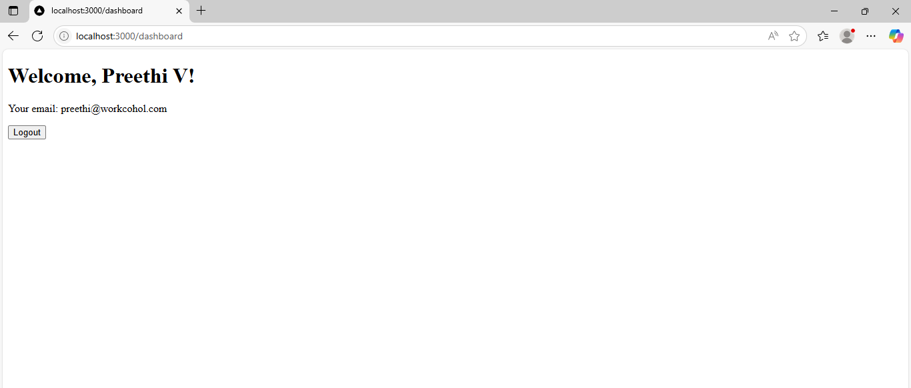

# Login page

This is my login page using next.js,firebase authentication and zustand

## Key Features

### Next.js
- __App Router/ File-based Routing__– Automatically handled by folder structure.
- __API Routes Support__ – Easily create backend endpoints without a separate server.

### Firebase Authentication
- __Google Sign-In Integration__– One-click login using Google accounts.
- __Secure Authentication Flow__ –Managed sessions using Firebase Auth.

### Zustand
- __Lightweight Global Store__–Simple, fast state management without boilerplate.
- __Easy Integration__ –Works seamlessly with React/Next.js apps.

## Installation

- Firebase package:
 ```
  npm install firebase
 ```
- Zustand package:
 ```
  npm install zustand
```
- Development Mode:
 ``` 
  npm run dev 
 ```

## Start project step by step:

- After installing all packages and writing the authentication code, run ```npm run dev``` in the terminal
- This will start the development server at ```http://localhost:3000``` 
- When you open this link in the browser, the login page will appear
- The user will be redirected to the dashboard page only after a successful login
- If not logged in, they will automatically be redirected back to the login page

## Output:
Screenshot of the login page displayed at `http://localhost:3000`

       -

       -
       
       -
